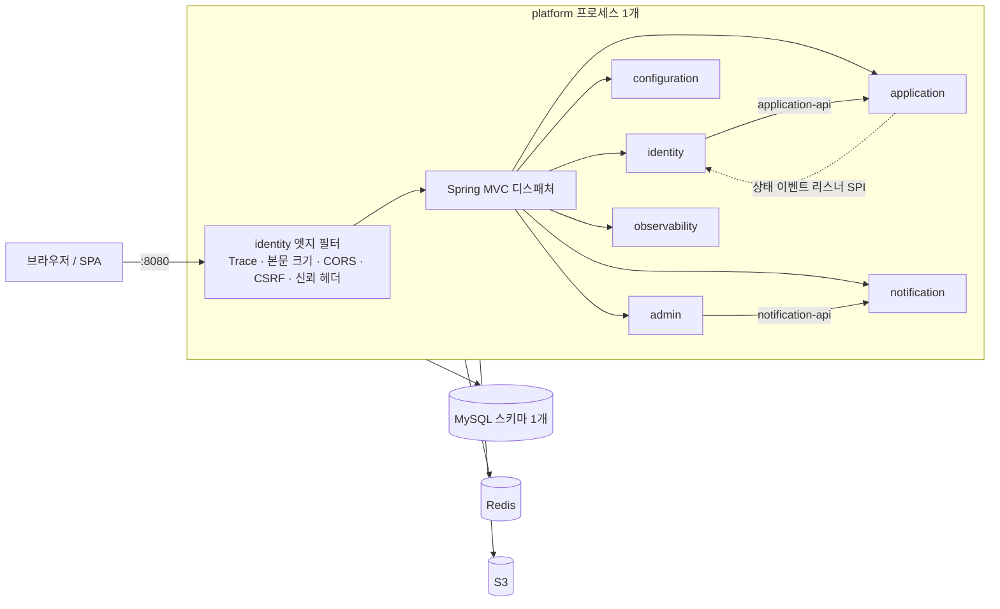

# 모듈러 모놀리식 전환 실행 계획

| 항목 | 내용 |
|---|---|
| 상태 | v1 — 구현 진행 중 (진행 상황은 [11. 진행 기록](#11-진행-기록)) |
| 기준일 | 2026-09-16 (D-30), 출시 D-0 = 2026-10-16 |
| 기준 커밋 | `develop` 868f8f79 |
| 작업 브랜치 | `enhancement/modular-monolith` |
| 인력 | 개발자 2명 (아래에서 A: 플랫폼·보안, B: 도메인·데이터) |

---

## 0. 요약

**최종 형태**: JVM 1개, Spring 컨텍스트 1개, 컨테이너 이미지 1개, MySQL 스키마 1개.
기존 6개 도메인(identity·application·configuration·notification·admin·observability)은 헥사고날 하위 모듈(domain / application / adapter-in / adapter-out)을 **그대로 둔 채** 하나의 프로세스 안의 "모듈"이 된다. Gateway는 Identity에 흡수된다.

| # | 결정 | 근거 절 |
|---|---|---|
| D1 | 실행 파일은 `//systems/platform/platform-bootstrap:main` 하나. 각 `*-bootstrap`은 실행 파일이 아니라 모듈 설정 라이브러리가 된다 | 3.2 |
| D2 | 모듈은 자기 패키지만 스캔하는 `<Module>ModuleConfiguration`으로 조립한다. 빈 이름은 FQCN으로 생성해 이름 충돌을 코드 수정 없이 없앤다 | 3.3 |
| D3 | Gateway의 엣지 책임(CSRF·CORS·trace id·본문 크기·신뢰 헤더·404)은 Identity의 서블릿 필터와 단일 Security 체인으로 옮긴다. 라우팅·재시도·서킷브레이커는 네트워크 홉이 없어지므로 버린다 | 4.2 |
| D4 | gRPC 계약은 제공 모듈의 `<module>-api`(순수 Kotlin interface + 불변 DTO + sealed 예외)로 대체한다. 소비 모듈의 outbound port는 바꾸지 않고 **어댑터 구현만** 교체한다 | 5.1 |
| D5 | 호출하는 곳이 없는 ConfigurationService gRPC는 옮기지 않고 삭제한다 (use case 포트는 유지) | 5.2 |
| D6 | application → identity 상태 동기화는 Redis Stream 대신 **in-process outbox 릴레이**로 바꾼다 (outbox 테이블·버전 기반 멱등 소비 재사용) | 5.6 |
| D7 | DB는 스키마 1개. 테이블 이름은 유지하고(충돌 없음), 마이그레이션은 **모듈별 Flyway 이력 테이블**로 분리한다 | 6.1 |
| D8 | 모듈 경계는 Bazel `visibility`로 빌드 단계에서 강제한다. 다른 모듈에는 `-api` 타깃으로만 의존할 수 있다 | 3.2 |
| D9 | 외부 계약(URL, 쿠키, CSRF 헤더, 신뢰 헤더, 에러 코드)은 바꾸지 않는다. 바뀌는 동작은 4.2의 목록으로 한정한다 | 4.2 |
| D10 | 전환 기간에는 기능 개발을 멈춘다. 전환 경로에서 발견한 기존 결함은 전환을 막는 것만 고치고 나머지는 별도 이슈로 뺀다 | 2.7, 8 |

**일정**: W1 조립·단일 DB → W2 계약 전환·엣지 이식(추석) → W3 운영 전환·스테이징 → W4 QA·컷오버 리허설 → D-3 동결. 실작업일 19일 × 2명 = 38인일 중 버퍼 9인일.

---

## 1. 전제

### 1.1 조건

- 운영 데이터 없음 → 데이터 마이그레이션 위험 낮음
- 개발자 2명, 출시까지 D-30 (공휴일 4일 포함, 실작업 19일)
- 애플리케이션 7개, 코드상 MySQL 스키마 5개(운영 기준 4개, 6.1 참고), 서비스 간 통신 gRPC + Redis Stream + HTTP

### 1.2 목표

1. Gateway와 Identity를 하나로 합친다.
2. 7개 애플리케이션을 모듈러 모놀리식으로 전환한다.
3. 각 도메인의 헥사고날 구조를 유지하고 기존 코드를 최대한 재사용한다.
4. gRPC proto 인터페이스를 in-process 호출용 port 인터페이스로 대체한다.
5. DB를 1개로 통합한다.

### 1.3 완료 정의 (Definition of Done)

- `bazel build //...`, `bazel test //...` 통과 (기준선에서 이미 실패하던 2건은 해소 또는 사유 기록)
- `//:platform` 하나로 MySQL·Redis에 붙어 기동하고 `/actuator/health`가 UP
- `contracts/`, `systems/gateway/`, gRPC·Spring Cloud Gateway 의존성이 저장소에 없다
- 모듈별 Flyway 이력 테이블 5개로 빈 스키마가 만들어지고 Hibernate `validate`를 통과한다
- 엣지 보안 계약 테스트(CSRF·CORS·trace·본문 크기·헤더 정화·신뢰 헤더 주입·404) 통과
- 이미지 1개로 빌드·배포하는 스크립트와 워크플로

---

## 2. 현황 진단

### 2.1 애플리케이션 7개

| 시스템 | 역할 | 헥사고날 모듈 | main 코드 (파일 / 줄) | 테스트 파일 | 저장소 |
|---|---|---|---|---|---|
| gateway | 외부 진입점: 라우팅, CSRF·CORS, 인증 헤더 주입, trace id, 본문 크기 제한, 서킷브레이커 (WebFlux) | domain · application · adapter-in · bootstrap | 30 / 1,377 | 25 | Redis (서킷 상태) |
| identity | 회원가입·로그인·JWT·PASS 본인인증, 원서 상태 조회·취소 창구 | 5개 + test-support | 134 / 4,429 | 47 | MySQL `identity_db`, Redis |
| application | 원서 작성·제출, 성적 산출(evaluation) | 5개 | 91 / 2,924 | 14 | MySQL `application_db`, Redis (상태 이벤트 발행) |
| configuration | 문서 파일(S3), 전형 일정, 환경변수 | 5개 | 79 / 2,321 | 14 | MySQL `configuration_db`, S3 |
| notification | 공지, 질문(FAQ), 모집요강 | 5개 | 47 / 1,419 | 6 | MySQL `notification_db` |
| admin | 지원자 관리·선발·통계·내보내기(PDF/XLSX), 공지 등록 위임 | 5개 | 79 / 3,757 | 12 | MySQL `admin_db`, S3 |
| observability | 클라이언트 로그·세션·지표·리포트·헬스 대시보드(SSE) | 5개 | 113 / 3,287 | 25 | Redis |
| **합계** | | Bazel 패키지 35개 | **573 / 19,514** | **143** | |

- 모든 서비스가 Spring Boot 4.0.7 + Kotlin, Bazel(`kt_jvm_binary`)로 빌드된다. gateway만 WebFlux이고 나머지 6개는 서블릿 MVC다.
- 서비스끼리 Kotlin 코드를 import하지 않는다. 결합은 `contracts/proto`, Redis Stream, HTTP뿐이다.

### 2.2 서비스 간 통신 지도

| 호출자 → 피호출자 | 방식 | 호출자 port / 어댑터 | 피호출자 use case | 실제 사용 |
|---|---|---|---|---|
| identity → application | gRPC `CancelApplication` | `ApplicationDataPort.cancel` → `GrpcApplicationDataAdapter` | `ApplicationPort.cancel` | **사용**. identity 트랜잭션이 projection 행을 `FOR UPDATE`로 잡은 채 원격 호출(데드라인 3초) |
| identity → application | gRPC `CreateApplication` | `ApplicationDataPort.create` | `findByUserId ?: createApplicant` | 프로덕션 호출 없음 (port 구현만 존재) |
| identity → application | gRPC `GetApplication` | `ApplicationDataPort.findByUserId` | `ApplicationPort.findByUserId` | 도달 불가 (`@Primary` 어댑터가 projection에서 읽음) |
| application → identity | DB outbox → 1초 릴레이 → Redis Stream `application.applicant-status`(Base64 protobuf) → 1초 소비 | `ApplicantStatusEventOutbox` | `ApplicationEventConsumer.consume` (버전 기반 멱등) | **사용**. 원서 생성·제출·취소 시 identity projection·`student_profiles` 갱신 |
| admin → notification | gRPC `CreateNotice` / `UpdateNotice` / `DeleteNotice` / `AnswerQuestion` | `NoticeRepository`, `QuestionAnswerRepository` → `GrpcNoticeAdapter`, `GrpcQuestionAnswerAdapter` | `NotificationPort.*` | **사용**. 호출자 쪽 트랜잭션 없음 (`SupportService` 의도적) |
| (없음) → configuration | gRPC 환경변수 CRUD 5개 | 없음 | `*EnvironmentVariableUseCase` | 클라이언트 없음 |
| gateway → identity | HTTP `GET /api/identity/v11/accounts/me/authority` (쿠키 전달) | `GatewayAccessGlobalFilter` | `AccountPort.getAuthority` | **사용**. 요청마다 권한 조회 후 신뢰 헤더 주입 |
| gateway → 6개 서비스 | HTTP 리버스 프록시 (8개 경로 prefix) | `GatewayRouteConfiguration` | 각 서비스 컨트롤러 | **사용** |
| observability → 4개 서비스 | HTTP `GET /actuator/health` | `ActuatorHealthCheckAdapter` | Actuator | **사용**. 대시보드·SSE 5초 주기 |

### 2.3 데이터 지도

| 스키마 | 테이블 (마이그레이션) | 비고 |
|---|---|---|
| `identity_db` | `accounts`, `student_profiles`, `application_projections`, `identity_outbox` (V001–V005) | `identity_outbox`는 쓰기만 하고 읽는 곳 없음 |
| `application_db` | `applicants`, `middle_school_infos`, `academic_records`, `subject_grades`, `ged_scores`, `pass_results`, `applicant_status_outbox` (V001–V003) | 모듈 내부 FK 있음 |
| `configuration_db` | `environment_variable`, `files`, `schedule` (V001–V002) | `schema.sql`, `ddl/*.sql`은 실행되지 않는 수기 문서 |
| `notification_db` | `notices`, `faqs`, `recruitment_guidelines` (V028–V030) | 버전이 28부터인 것은 Flyway 도입 전 전역 번호 체계의 흔적 (공유 스키마 아님) |
| `admin_db` | `applicant`, `score_policy`, `export_job`, `admission_quota`, `notice`, `question_answer` (V001–V002) | `applicant`는 채우는 코드가 없는 사본, `notice`·`question_answer`는 엔티티가 없는 죽은 테이블 |

- 5개 스키마 사이에 **테이블 이름 충돌은 없다** (`applicant`/`applicants`, `notice`/`notices`처럼 비슷한 이름만 있음). 충돌은 `flyway_schema_history` 테이블과 마이그레이션 버전(V001 ×4, V002 ×4, V003 ×2)뿐이다.
- 5개 서비스 모두 Flyway가 실제로 실행된다. admin·configuration은 `lazy-initialization: true`라 마이그레이션과 스키마 검증이 첫 요청 때 일어난다.

### 2.4 빌드·배포

- 서비스마다 `kt_jvm_binary :main` → `prepare-images.sh`가 runfiles를 `dist/<svc>`로 복사 → 같은 `Dockerfile`로 이미지 7개(`ghcr.io/entrydsm/entrydsm-<svc>`) → `docker-compose.yml`로 호스트마다 7개 컨테이너 + Redis. 외부 포트는 gateway의 8080 하나.
- 리소스는 모두 jar 루트에 들어간다. 한 클래스패스에 올리면 `application.yaml` 7개 중 첫 번째만 읽히고, Flyway는 모든 서비스의 `db/migration/V001__*`을 한꺼번에 읽어 버전 중복으로 멈춘다.
- 모든 Bazel 패키지가 `//visibility:public`이라 모듈 경계를 강제하는 장치가 없다.

### 2.5 기준선 (develop 868f8f79, 2026-09-16 로컬 실행)

| 항목 | 결과 |
|---|---|
| `bazel build //systems/... //contracts/...` | 98개 중 97개 성공. `//systems/gateway/gateway-adapter-in:test`는 선언되지 않은 `spring-security-test`를 참조해 분석 실패 (게다가 `SecurityWebConfigTest`는 정의되지 않은 `LOGOUT`을 참조해 컴파일도 안 됨) |
| `bazel test //systems/...` (위 타깃 제외) | 49개 중 48개 통과. `//systems/identity/identity-bootstrap:test` 실패 — 컨텍스트 기동 시 `ApplicationEventConsumer` 빈 없음 |
| CI | 워크플로에 테스트 단계가 없다 |
| 컨텍스트 기동 검증 | admin·application·configuration·notification·observability의 bootstrap 테스트는 `assertTrue(true)` 수준이라 실제 기동을 검증하지 않는다 |

### 2.6 한 컨텍스트로 합칠 때 막히는 지점

**기동 자체가 실패하는 것 (P0)**

| 충돌 | 위치 | 해소 방법 (단계) |
|---|---|---|
| 스캔 빈 이름 중복 6건: `globalExceptionHandler` ×5, `applicationController`, `applicantPersistenceAdapter`, `s3StorageAdapter`, `clockConfig`, `grpcServerConfig` | 각 모듈 adapter·bootstrap | 모듈 스캔에 FQCN 빈 이름 생성기 (Stage 1) |
| `@Bean` 이름 중복: `clock` ×3, `applicationService`(반환 타입도 다름), `grpcServer` ×2, `s3Client`·`s3Presigner` ×2 | `AdminConfig`, `ClockConfig` ×2, `*UseCaseConfig`, `GrpcServerConfig`, `S3Config` | 공용 인프라 빈은 platform에 1개, `applicationService`는 메서드 이름 변경, gRPC 서버는 삭제 (Stage 1·2) |
| Spring Data 리포지토리 이름 중복 `applicantJpaRepository` | admin, application | 리포지토리 스캔에도 FQCN 이름 생성기 (Stage 1) |
| JPA 엔티티 이름 중복 `ApplicantJpaEntity` | admin, application | admin 엔티티에 `@Entity(name = "AdminApplicantJpaEntity")` (Stage 1) |
| Flyway 버전·이력 테이블 중복 | 5개 bootstrap `db/migration` | 모듈별 위치·이력 테이블 (Stage 1) |
| gRPC 서버 3개가 같은 `grpc.port` | application, notification, configuration | gRPC 삭제 (Stage 2) |
| `application.yaml` 7개, `application-dev.yaml` 5개가 같은 클래스패스 경로 | 각 bootstrap | platform에만 `application.yaml`, 모듈은 `modules/<module>.yaml` (Stage 1) |
| `ApplicationCommandService`가 final 클래스인데 클래스 레벨 `@Transactional` → CGLIB 프록시 생성 불가 | `application-application/BUILD.bazel`에 allopen 플러그인 없음 | allopen 플러그인 적용 (Stage 1) |

**기동은 되지만 조용히 동작이 바뀌는 것 (P1)**

| 충돌 | 영향 | 해소 (단계) |
|---|---|---|
| configuration 인터셉터가 `/api/**`(schedule 제외)에 걸림 | 로그인·공지·평가·모니터링 요청이 전부 401/403 | 경로를 `/api/document/**`로 축소 (Stage 1) |
| 범위 없는 `@RestControllerAdvice` 7개, 모두 `Exception` 캐치올 보유 | 먼저 등록된 advice 하나가 모든 모듈의 에러 형식을 결정, SSE 에러 처리(#175) 회귀 | 모듈 패키지로 범위 한정 + platform 폴백 (Stage 1·3) |
| identity `SecurityFilterChain`이 `anyRequest().authenticated()`로 끝남, `JwtFilter`가 `/*`에 자동 등록 | 공개 API(공지·일정·수집)가 401, 모든 요청에 Redis·DB 토큰 검증 | 단일 체인 + 경로별 규칙 (Stage 3) |
| `lazy-initialization`이 서비스마다 다름 | Redis 내구성 검사·PASS 라이선스 초기화가 실행 안 됨, Flyway 지연 | 전역 `false` (Stage 1) |
| 스케줄러 스레드 1개를 6개 `@Scheduled`가 공유 | SSE 브로드캐스트·릴레이 지연 | 풀 크기 4 (Stage 1) |
| Redis 설정 3종(`url` / `host`+`port` / 없음) | 하나의 연결 팩토리로 합쳐짐 | 연결 설정 1종 (Stage 1) |
| observability가 자기 자신을 HTTP로 헬스체크 | 대시보드 상태 무의미 | in-process 헬스 어댑터 (Stage 4) |
| open-in-view 기본값(true)인 admin·configuration | S3 호출 동안 DB 커넥션 점유 | 전역 `false` (Stage 1) |

### 2.7 전환 경로에서 발견한 기존 결함

| # | 결함 | 영향 | 처리 |
|---|---|---|---|
| E1 | `ApplicationCommandService` final + `@Transactional` | application 컨텍스트 기동 실패 또는 원서 변경·outbox 쓰기 비원자적 | **Stage 1에서 수정** (전환을 막음) |
| E2 | `ApplicantStatusOutboxJpaEntity`에 인자 없는 생성자 없음 (`jpa_noarg` 미적용) | outbox 쓰기·릴레이 실패 | **Stage 2에서 수정** (outbox를 다시 쓰므로) |
| E3 | outbox 어댑터의 `PassStatus.valueOf("PASS_STATUS_${name}")` 오매핑 | 최종 합격 발표 시 예외 | **Stage 2에서 제거** (protobuf 매핑 자체가 사라짐) |
| E4 | identity 취소가 projection `sourceVersion`을 먼저 올려 뒤따르는 CANCELED 이벤트가 무시됨 | `student_profiles`가 SUBMITTED로 남아 계정 삭제 불가 | 별도 이슈 (전송 방식과 무관, 테스트가 현재 동작을 고정하고 있음) |
| E5 | `subject_grades.school_semester VARCHAR(20)`인데 enum 이름이 26–28자 | 성적 저장 시 "Data too long" | 별도 이슈 (마이그레이션 1줄) |
| E6 | `identity_outbox` 쓰기만 하고 발행 없음 | 없음 (죽은 데이터) | 출시 후 정리 |
| E7 | 없는 경로·메서드가 모든 서비스에서 500 (bug/169 진행 중) | 잘못된 상태 코드 | platform 폴백 핸들러로 404/405 (Stage 3) |
| E11 | Netty 버전 혼재: awssdk 의 netty-nio-client 가 4.1 계열 `netty-codec` 을, lettuce 등이 4.2 계열을 끌어온다 | 한 프로세스에서 Redis 명령 인코딩 시 `AbstractMethodError` 로 기동 실패 | Stage 3 에서 `netty-codec` 을 4.2 계열로 고정해 해소 (서비스가 나뉘어 있을 때는 드러나지 않던 문제) |
| E10 | identity `SecurityConfigTest` 13개가 기준선에서 모두 실패(게이트웨이로 옮겨간 CSRF 동작을 여전히 기대) | 보안 회귀를 잡지 못함 | Stage 2 에서 삭제하고 Stage 3 에서 엣지 계약 테스트로 다시 작성 |
| E8 | 에러 로그 MDC 키가 `X-trace-Id`/`correlationId`로 제각각이고 아무도 설정하지 않음 | trace id가 로그에 안 남음 | 엣지 필터가 `X-Trace-Id` MDC 설정 (Stage 3), 키 통일은 출시 후 |
| E9 | admin 문서 조회 키 규칙(`application/…`)과 configuration 저장 키 규칙(`dsm_Entry/Backend/…`) 불일치 | admin이 configuration에 올린 원서 PDF를 못 찾음 | 오픈 이슈 (12절) |

---

## 3. 목표 구조

### 3.1 런타임 구조



### 3.2 Bazel 모듈 구조와 의존 규칙

```
systems/
├── platform/
│   └── platform-bootstrap/     # 신규. 유일한 실행 파일(:main), application.yaml, 공용 인프라 빈, 모듈별 Flyway
├── identity/                   # gateway 흡수
│   ├── identity-domain · identity-application · identity-adapter-in · identity-adapter-out
│   └── identity-bootstrap/     # 라이브러리. IdentityModuleConfiguration, SecurityConfig, 엣지 필터
├── application/
│   ├── application-api/        # 신규. application.proto 대체
│   └── application-domain · -application · -adapter-in · -adapter-out · -bootstrap
├── notification/
│   ├── notification-api/       # 신규. notification.proto 대체
│   └── notification-domain · -application · -adapter-in · -adapter-out · -bootstrap
├── configuration/ · admin/ · observability/   # 구조 유지, bootstrap만 라이브러리로
contracts/        → 삭제
systems/gateway/  → 삭제 (기능은 identity-bootstrap으로 이식)
```

**의존 규칙**

1. 모듈 내부는 기존 헥사고날 규칙 그대로: domain ← application ← adapter-in / adapter-out ← bootstrap.
2. 다른 모듈에는 `<module>-api` 타깃으로만 의존한다. `-api`는 프레임워크·도메인 의존이 없는 순수 Kotlin이다.
3. 동기 호출 방향: 소비자 adapter-out → 제공자 `-api` ← 제공자 adapter-in(구현).
4. 제공자가 소비자에게 알려야 하면 제공자 `-api`에 리스너 SPI를 두고 소비자가 구현한다 (의존 역전, 순환 금지).
5. `platform-bootstrap`만 모든 모듈의 bootstrap에 의존한다.
6. 강제 수단: 모듈 내부 타깃의 `visibility`는 자기 모듈 + platform으로 제한하고, `-api`는 허용된 소비자 모듈에만 연다. 위반하면 빌드가 깨진다.

### 3.3 조립·설정·리소스 규칙

| 대상 | 규칙 |
|---|---|
| 진입점 | `hs.kr.entrydsm.platform.PlatformApplication` (`@SpringBootApplication`은 platform 패키지만 스캔, 모듈 설정은 `@Import`) |
| 모듈 조립 | 각 bootstrap의 `<Module>ModuleConfiguration`이 `@ComponentScan(자기 패키지, FQCN 빈 이름)`, `@EntityScan(자기 패키지)`, `@EnableJpaRepositories(자기 패키지, FQCN 빈 이름)`를 선언 |
| 공통 설정 | `application.yaml`은 platform에만 둔다: datasource, jpa, redis, server, management, 스케줄러, 멀티파트 |
| 모듈 설정 | `modules/<module>.yaml`(각 bootstrap 소유). platform이 `spring.config.import`로 가져온다. dev 기본값은 같은 파일의 `on-profile: dev` 문서에 둔다. `config/`는 Spring Boot 기본 설정 위치라 `config/application.yaml`이 자동으로 읽히므로 쓰지 않는다 |
| 마이그레이션 | `db/migration/<module>/` + 이력 테이블 `flyway_schema_history_<module>` |
| 공용 인프라 빈 | `Clock`, `S3Client`, `S3Presigner`는 platform이 한 번만 정의 |
| 환경변수 | `systems/platform/.env.example` 하나. 서비스별 `.env.example`은 삭제 |

---

## 4. 모듈 경계 설계

### 4.1 모듈별 책임·공개 API·데이터 소유

| 모듈 | 책임 | 공개 API | 소비하는 API | 소유 테이블 | 외부 자원 |
|---|---|---|---|---|---|
| identity | 계정·인증·JWT·PASS, **엣지 보안(구 gateway)**, 원서 상태 조회·취소 창구 | 없음 (인증 결과는 신뢰 헤더로 전달) | `application-api` (취소·조회, 상태 이벤트 구독) | `accounts`, `student_profiles`, `application_projections`, `identity_outbox` | Redis: refresh token, PASS proof |
| application | 원서·성적 산출 | `ApplicationApi`, `ApplicantStatusChangedListener` | 없음 | `applicants`, `middle_school_infos`, `academic_records`, `subject_grades`, `ged_scores`, `pass_results`, `applicant_status_outbox` | 없음 (Redis 의존 제거) |
| notification | 공지·FAQ·모집요강 | `NotificationApi` | 없음 | `notices`, `faqs`, `recruitment_guidelines` | 없음 |
| configuration | 문서 파일·일정·환경변수 | 없음 (소비자 없음) | 없음 | `files`, `schedule`, `environment_variable` | S3 |
| admin | 운영자 기능 | 없음 | `notification-api` | `applicant`(사본), `score_policy`, `export_job`, `admission_quota`, `notice`·`question_answer`(미사용) | S3 |
| observability | 모니터링·대시보드 | 없음 | 없음 (헬스는 in-process) | 없음 | Redis `monitor:*` |
| platform | 조립·공용 인프라·스키마 마이그레이션 실행 | — | 모든 모듈 bootstrap | `flyway_schema_history_*` | — |

**모듈 경계 규칙**

- 다른 모듈의 테이블을 읽거나 쓰지 않는다. 조인도 금지한다. 필요하면 제공 모듈의 `-api`를 늘린다.
- 모듈 간 참조 컬럼(`applicants.account_id`, `applicants.photo_file_id`, `files.owner_user_id`, `pass_results.processed_by`, `notices.attachment_ids`)은 FK 없이 논리 참조로 둔다.
- 경계를 넘는 데이터는 `-api` DTO뿐이다. 엔티티·도메인 모델·모듈 내부 예외는 넘기지 않는다.

### 4.2 Gateway + Identity 통합

**원칙**: 외부 계약은 그대로 둔다. 사라지는 것은 네트워크 홉이 있어야만 의미가 있던 기능뿐이다.

**Gateway가 실제로 하던 일** (코드 분석 결과)

- JWT를 직접 검증하지 않는다. identity 이외 경로에 `access_token` 쿠키가 있으면 identity의 `/accounts/me/authority`를 HTTP로 호출해 `X-User-Id`, `X-User-Role`, `user-id`, `X-Sensitive-Agree` 헤더를 붙여 넘긴다.
- 경로별 권한 판단은 하지 않는다. 권한은 각 서비스 인터셉터가 신뢰 헤더로 판단한다.
- 클라이언트가 보낸 신뢰 헤더 6종(`X-User-Id`, `X-User-Role`, `user-id`, `X-Sensitive-Agree`, `X-Real-IP`, `X-Forwarded-For`)을 지우고 `X-Real-IP`를 새로 붙인다.
- CSRF(쿠키 `XSRF-TOKEN` = 헤더 `X-XSRF-TOKEN`, 평문 토큰, `/auth/pass/popup`만 제외), CORS, `X-Trace-Id`, 본문 10 MiB 제한을 처리한다.
- 라우트는 경로를 바꾸지 않는다 (`stripPrefix(1)` + `prefixPath("/api")`는 원래 경로를 그대로 복원). 설정된 Retry 필터는 Java 라우트에 적용되지 않아 실제로는 동작하지 않았다.

**서블릿 요청 처리 순서 (전환 후)**

| 순서 | 구성 요소 | 하는 일 | 거부 시 응답 |
|---|---|---|---|
| 1 | `TraceIdFilter` (컨테이너 필터, 최우선) | `X-Trace-Id` 검증·생성, 응답 헤더, MDC | 400 `INVALID_TRACE_ID` |
| 2 | `RequestBodyLimitFilter` | `Content-Length`와 스트림 바이트로 본문 크기 제한 | 413 `REQUEST_TOO_LARGE` |
| 3 | Spring Security 체인 1개 — `CorsFilter` | 기존 CORS 값 그대로 (origin 목록, 메서드, 헤더, credentials, maxAge) | preflight 거부 |
| 4 | — `CsrfFilter` | 쿠키 저장소(`Secure`, `HttpOnly`, `SameSite=Lax`, `Path=/`), 평문 토큰 처리기, popup 경로만 제외 | 403 `text/plain` "Access Denied" (기존과 동일) |
| 5 | — `EdgeAccessFilter` (구 `GatewayAccessGlobalFilter`) | 신뢰 헤더 제거 → `X-Real-IP` 설정 → 알려진 경로 prefix가 아니면 404 → identity 외 경로에 쿠키가 있으면 **in-process로** 토큰 검증·권한 조회 후 신뢰 헤더 주입 | 404 `ROUTE_NOT_FOUND`, 401 `AUTH_UNAUTHORIZED`, 503 `IDENTITY_UNAVAILABLE` |
| 6 | — `JwtFilter` | identity 경로에서만 동작 (Bearer 또는 쿠키, 기존 규칙) | identity 형식 401 |
| 7 | — `AuthorizationFilter` | ASYNC·ERROR 디스패치 허용, actuator·identity 공개 경로·logout 허용, `/api/identity/**` 인증 필요, 나머지 허용 | identity 형식 401 |
| 8 | MVC 인터셉터 (모듈 코드 변경 없음) | 신뢰 헤더로 역할 판단 (admin=ADMIN, application=STUDENT, document∈{ADMIN,STUDENT}, schedule 쓰기=ADMIN, monitor=MONITOR) | 각 모듈 형식 401/403 |

**그대로 두는 것**: 경로·쿠키·CSRF 헤더 이름, 신뢰 헤더 이름과 값, `GET /api/identity/v11/auth/csrf` 응답 형태, 엣지 에러 JSON `{"status","error","traceId"}`, 각 모듈 에러 형식.

**버리는 것**: `GatewayRouteConfiguration`, 서킷브레이커(resilience4j + Redis `gateway:circuit:*`), `DownstreamFailure*`, identity 호출용 `WebClient`, 미사용 `GatewayAccessPolicy`, Reactor MDC 훅, `gateway.downstream.*`·`gateway.services.*`·`gateway.resilience.*` 설정.

**의도적으로 바뀌는 동작** (릴리스 노트에 적는다)

| 전 | 후 | 이유 |
|---|---|---|
| 서킷 열림 503 `CIRCUIT_OPEN`, 연결 실패 502, 타임아웃 504 | 발생하지 않음 | 다운스트림 네트워크 홉 없음 |
| `IDENTITY_UNAVAILABLE` = identity 서비스 장애 | = 토큰 검증 중 Redis·DB 장애 | 같은 코드, 원인만 in-process |
| CSRF 403 응답에 CORS 헤더 없음 | CORS 헤더 있음 | Security의 `CorsFilter`가 `CsrfFilter`보다 앞 |
| 알려진 prefix 아래의 없는 경로는 서비스에서 500 | platform 폴백이 404/405 | E7 해소 |
| `X-Trace-Id`는 라우팅된 응답에만 | 모든 응답에 | 필터가 컨테이너 레벨 |

**설정·환경변수 매핑**

| 기존 (gateway) | 전환 후 |
|---|---|
| `GATEWAY_CORS_ALLOWED_ORIGINS` | `EDGE_CORS_ALLOWED_ORIGINS` |
| `GATEWAY_REQUEST_MAX_BODY_BYTES` | `EDGE_REQUEST_MAX_BODY_BYTES` |
| `GATEWAY_SERVICES_*`, `GATEWAY_DOWNSTREAM_*`, `GATEWAY_RESILIENCE_*` | 삭제 |

### 4.3 일부러 남기는 중복

전환의 목표는 "동작을 바꾸지 않고 합치기"다. 아래 중복은 알고도 남기고 출시 후 과제로 넘긴다.

| 중복 | 남기는 이유 | 출시 후 방향 |
|---|---|---|
| admin `applicant` 사본 (채우는 코드 없음) vs application `applicants` | 선발·통계 로직 전체가 사본 모델에 묶여 있고 enum 값도 다름 | admin이 `application-api`로 조회 |
| identity `application_projections`·`student_profiles` 상태 컬럼 | identity 서비스·도메인 규칙(계정 삭제 검사)이 의존 | identity가 `application-api`로 직접 조회, projection 제거 |
| `ApplicantStatus`·`AdmissionType`·`Region` enum 3벌, 응답 envelope 6종 | 모듈별 API 계약 | 공용 에러 형식 합의 후 통합 |
| admin·configuration S3 버킷·키 규칙 2종 | 저장 경로가 이미 달라 합치면 데이터 위치가 바뀜 | 문서 저장소 모듈 1개로 |
| `recruitment_guidelines` / `schedule` / application 일정 환경변수 | 일정 원천이 셋이지만 쓰는 화면이 다름 | 일정 원천 1개로 합의 |

---

## 5. proto → port 전환

### 5.1 전환 패턴

```
[전]  identity-application          identity-adapter-out              application-adapter-in        application-application
      ApplicationDataPort  ◀──구현── GrpcApplicationDataAdapter ─gRPC→ ApplicationGrpcService ──호출→ ApplicationPort

[후]  identity-application          identity-adapter-out              application-api        application-adapter-in     application-application
      ApplicationDataPort  ◀──구현── ApplicationApiDataAdapter ──호출→ ApplicationApi ◀──구현── ApplicationApiAdapter ──호출→ ApplicationPort
      (변경 없음)                                                       (신규, 순수 Kotlin)                                (변경 없음)
```

- 소비자의 port·서비스·도메인과 제공자의 use case는 건드리지 않는다. 바뀌는 곳은 양쪽 어댑터와 새 `-api` 모듈뿐이다.
- `-api`는 proto를 1:1로 옮긴다: service → interface, message → 불변 `data class`, enum → Kotlin enum(UNSPECIFIED 제거), gRPC Status → sealed 예외.
- 제공자 어댑터는 gRPC 서비스가 하던 입력 검증·매핑·예외 변환을 그대로 가져간다. 소비자 어댑터는 gRPC 클라이언트가 하던 매핑·예외 변환을 그대로 가져간다.

### 5.2 계약별 대체표

| proto | 현재 사용 | 대체 | 소비자 어댑터 |
|---|---|---|---|
| `ApplicationService.CancelApplication` | identity 취소 API | `ApplicationApi.cancelApplication(userId, reason)` | identity `ApplicationApiDataAdapter.cancel` |
| `ApplicationService.CreateApplication` | port 구현만 존재 | `ApplicationApi.createApplication(userId)` | `ApplicationApiDataAdapter.create` |
| `ApplicationService.GetApplication` | 도달 불가 | `ApplicationApi.getApplication(userId)` | `ApplicationApiDataAdapter.findByUserId` |
| `ApplicantStatusChangedEvent` (Redis Stream) | application → identity 상태 동기화 | `ApplicantStatusChangedEvent` + `ApplicantStatusChangedListener` (5.6) | identity 리스너 → `ApplicationEventConsumer.consume` |
| `NotificationService.CreateNotice` / `UpdateNotice` / `DeleteNotice` / `AnswerQuestion` | admin 공지·답변 | `NotificationApi.createNotice` / `updateNotice` / `deleteNotice` / `answerQuestion` | admin `NotificationApiNoticeAdapter`, `NotificationApiQuestionAnswerAdapter` |
| `ConfigurationService` (환경변수 CRUD 5개) | 클라이언트 없음 | **삭제**. use case 포트는 남기고, 소비자가 생기면 그때 `configuration-api`를 만든다 | — |
| (진행 중 `feature/177`) `GetApplicant` | configuration 수험표 생성 | 머지 시점에 `ApplicationApi.getApplicant`로 추가 | configuration adapter-out |

### 5.3 직렬화를 없앨 때 챙길 것

| 항목 | gRPC에서는 | in-process에서는 |
|---|---|---|
| 시간 | epoch millis, `LocalDateTime`을 UTC로 간주해 변환 | API 타입은 `Instant`. 변환 규칙(`ZoneOffset.UTC`)은 제공자 어댑터에 고정하고, 컨테이너 시간대를 `TZ=UTC`로 명시한다 (`LocalDateTime.now()`가 JVM 시간대를 따르므로) |
| 값의 존재 | `optional` + `has*()` | nullable. `AttachmentIds` 래퍼(안 보냄 vs 빈 목록)는 `List<String>?`로 옮기고 "null = 유지, 빈 목록 = 모두 제거"를 KDoc에 적는다 |
| 기본값 | 누락 필드가 0 / "" / UNSPECIFIED | null 또는 필수 파라미터. UNSPECIFIED 분기 대신 exhaustive `when` |
| 입력 검증 | gRPC 서버에서 수행 (`userId > 0`, 카테고리 별칭 파싱, 길이 검사) | 제공자 어댑터·command에서 **그대로** 수행. 같은 JVM이라고 생략하지 않는다 |
| 복사 의미 | 직렬화가 방어적 복사를 대신함 | DTO는 `val` + 읽기 전용 `List`. 넘겨받은 컬렉션은 복사해서 보관 |
| 경계 누출 | 불가능 | 엔티티·도메인 모델·지연 로딩 프록시·제공자 예외를 반환하지 않는다. `open-in-view=false`라 누출하면 곧바로 `LazyInitializationException` |
| 하위 호환 | 필드 번호로 느슨한 호환 | 컴파일 타임 결합. API 변경은 제공자·소비자를 한 PR에서 고치고, Bazel이 깨짐을 잡는다 |
| 남는 직렬화 | Redis Stream payload | outbox는 DB에 남아야 하므로 protobuf blob 대신 **타입 있는 컬럼**으로 저장한다 (application V004) |

### 5.4 트랜잭션 경계

gRPC에서는 호출마다 원격 서비스가 독립 트랜잭션을 열었다. in-process에서는 제공자의 `@Transactional`(REQUIRED)이 호출자 트랜잭션에 **합류**한다.

| 경계 호출 | 호출자 트랜잭션 | 전환 후 | 판단 |
|---|---|---|---|
| identity 취소 → application 취소 | 있음 (projection 행 `FOR UPDATE`) | 한 트랜잭션으로 원자적 | **채택**. "원격은 취소됐는데 로컬 저장 실패" 같은 부분 실패가 사라진다. 잠금 순서는 projection → applicants로 고정 |
| admin 공지·답변 → notification | 없음 (`SupportService`에 의도적으로 없음) | 제공자 어댑터 트랜잭션 1회 | 유지 |
| application 상태 변경 → identity projection | 비동기 | outbox는 원서 트랜잭션에, 전달은 릴레이의 건별 트랜잭션에 | 5.6 |

**규칙**

1. 모듈 경계 호출은 REQUIRED 합류가 기본이다. 합류하면 안 되는 경우에만 `REQUIRES_NEW` 또는 커밋 후 이벤트를 명시한다.
2. 제공자에서 난 런타임 예외는 호출자 트랜잭션을 rollback-only로 만든다. 소비자 어댑터는 예외를 삼키지 않고 자기 예외로 바꿔 **다시 던진다** (삼키면 커밋 시점에 `UnexpectedRollbackException`).
3. 트랜잭션은 합쳐도 쓰기는 API를 통한다. 다른 모듈 테이블에 직접 쓰지 않는다.
4. 원격 호출이 없어져도 긴 트랜잭션은 남는다 (admin `DocumentService`: PDF 렌더링 + S3 업로드, `ExportJobProcessor`: 대량 ZIP). 커넥션 풀 크기와 타임아웃으로 관리하고 분리는 출시 후로 둔다.
5. 선결 조건: E1(final 클래스라 프록시가 안 걸림)을 먼저 고친다.

**교착 검토**: application 제출 경로는 `applicants` → outbox INSERT만 잠그고 projection은 잠그지 않는다(비동기). identity 취소는 projection → `applicants` 순서다. 두 경로가 서로 반대 순서로 같은 행을 잡지 않으므로 교착 조건이 없다. 릴레이는 건별 짧은 트랜잭션으로 돌린다.

### 5.5 에러 처리

**원칙**: 제공자 내부 예외 타입을 소비자에게 노출하지 않는다. `-api`의 sealed 예외가 gRPC Status 코드 역할을 이어받는다.

| 계약 | gRPC Status | API 예외 | 소비자 매핑 (기존 값 유지) |
|---|---|---|---|
| application | `INVALID_ARGUMENT` | `ApplicationApiException.InvalidArgument` | identity `INVALID_REQUEST_BODY` (400) |
| application | `NOT_FOUND` | `ApplicationApiException.NotFound` | `findByUserId`는 `null`, 그 외 `USER_NOT_FOUND` (404) |
| application | `FAILED_PRECONDITION` | `ApplicationApiException.CancelNotAllowed` | `APPLICATION_CANCEL_NOT_ALLOWED` (409) |
| application | `INTERNAL` (그 외) | 변환하지 않고 원래 예외 전파 | `INTERNAL_SERVER_ERROR` (500) |
| notification | `INVALID_ARGUMENT` | `NotificationApiException.InvalidArgument` | admin `INVALID_REQUEST_BODY` (400) |
| notification | `NOT_FOUND` | `NotificationApiException.NotFound` | 등록 시 500, 수정·삭제 `NOTICE_NOT_FOUND` (404), 답변 `QUESTION_NOT_FOUND` (404) |
| 공통 | `UNAVAILABLE`, `DEADLINE_EXCEEDED` | 없음 | 발생하지 않음. `*_SERVICE_UNAVAILABLE` 코드는 남기되 사용처만 제거 |

- 재시도·데드라인은 제거한다. in-process 재시도는 중복 쓰기만 만든다.
- HTTP 에러 렌더링은 각 모듈의 advice를 **자기 패키지로 한정**해 모듈별 에러 형식을 유지한다. 컨트롤러에 도달하지 못한 에러(404·405·413 등)는 platform 폴백 핸들러가 엣지 형식으로 응답한다.

### 5.6 비동기 상태 이벤트 (application → identity)

**현재**: 원서 트랜잭션에서 `applicant_status_outbox`에 protobuf를 저장 → 1초 릴레이가 Redis Stream에 XADD → identity가 1초마다 XREADGROUP → projection·`student_profiles` 갱신 → XACK.

**현재 구조의 문제**: Redis에 영속 설정이 없어 발행 표시된 이벤트가 유실될 수 있다. 독성 메시지 하나가 스트림을 영구히 멈춘다. E1·E2·E3 때문에 원자성과 매핑이 이미 깨져 있다.

| 선택지 | 방식 | 장점 | 단점 |
|---|---|---|---|
| A. 동기, 같은 트랜잭션 | outbox 대신 identity 소비 로직을 즉시 호출 | 가장 강한 일관성 | identity 장애(프로필 없음 등)가 원서 제출을 롤백시킴 — **동작 변경** |
| B. `@TransactionalEventListener(AFTER_COMMIT)` | 커밋 후 메모리 이벤트 | 코드 적음 | 커밋 직후 프로세스가 죽으면 유실, 재처리 수단 없음 |
| **C. in-process outbox 릴레이** | outbox 유지, 릴레이가 Redis 대신 identity 리스너를 직접 호출하고 같은 트랜잭션에서 `published_at` 기록 | 기존 outbox·멱등 소비 재사용, 제출이 identity 장애와 분리, 단일 DB라 "소비 + 발행 표시"가 원자적 | 1초 지연 유지 |
| D. projection 제거 | identity가 application을 직접 조회 | 가장 단순, 완전 일관 | identity 서비스·도메인 규칙 수정 필요 — 헥사고날 내부 변경 |

**결정: C.** 출시 후 D로 간다.

**구현 규칙**

- `application-api`에 `ApplicantStatusChangedEvent`와 `ApplicantStatusChangedListener`(SPI)를 둔다. identity가 리스너를 구현한다 (의존 방향: identity → application-api).
- 릴레이는 미발행 행을 `FOR UPDATE SKIP LOCKED`로 가져와 **행마다** 트랜잭션을 열고 리스너 호출 → `published_at` 기록 순서로 처리한다. 실패한 행은 로그를 남기고 다음 주기에 재시도하며, 다른 행 처리를 막지 않는다.
- 인스턴스가 여러 대여도 `SKIP LOCKED`로 같은 행을 동시에 잡지 않고, 소비 쪽 버전 검사로 중복 전달도 무해하다.
- application에서 Redis·protobuf 의존을 없앤다. outbox는 타입 있는 컬럼으로 바꾼다 (V004, 빈 스키마 기준이라 데이터 변환 없음).

---

## 6. DB 통합 전략

### 6.1 현황과 결정

**코드와 운영의 차이**: 코드에는 스키마 5개(`admin_db`, `application_db`, `configuration_db`, `identity_db`, `notification_db`)가 있다. 팀이 파악한 운영 DB는 4개다. admin 컨테이너에 DB 환경변수가 없어 `admin_db`에 붙지 못했던 이력(bug/115, 미머지)과 admin의 지연 초기화를 보면 `admin_db`가 운영에 없는 것으로 보인다. 어느 쪽이든 목표 상태는 같다.

| # | 결정 | 이유 |
|---|---|---|
| 1 | MySQL 스키마 1개(`entrydsm`), DataSource·EntityManagerFactory·TransactionManager 각 1개 | 모듈 간 트랜잭션 합류(5.4) 전제 |
| 2 | **테이블 이름 유지** | 충돌이 없다. 모듈 접두사(`identity_accounts` 등)는 가독성은 좋지만 엔티티 21개·마이그레이션 전체를 바꿔야 해 출시 후로 미룬다 |
| 3 | **모듈별 Flyway**: 위치 `classpath:db/migration/<module>`, 이력 `flyway_schema_history_<module>`, `baselineOnMigrate=true`, `baselineVersion=0`, `cleanDisabled=true` | 모듈이 각자 V001부터 번호를 매기고 있고 모듈 간 FK가 없어 실행 순서에 제약이 없다. 두 번째 모듈부터는 "이력 없는 비어 있지 않은 스키마"로 보이므로 baseline 0이 필요하다 (기본값 1이면 V001을 건너뜀) |
| 4 | 기존 마이그레이션 파일은 **내용을 바꾸지 않고 폴더만 옮긴다** | 체크섬 유지, 검토 부담 최소 |
| 5 | 모든 프로파일 `ddl-auto=validate`, `open-in-view=false`, `lazy-initialization=false` | dev의 `update`가 스키마 드리프트를 숨겼다. 마이그레이션·검증을 기동 시점에 실패시킨다 |
| 6 | 모듈 간 FK 금지 | 4.1 |
| 7 | 실행되지 않던 `schema.sql` 2개와 `configuration-bootstrap/ddl/` 삭제 | 실제 스키마와 이미 달라 혼란만 준다 |
| 8 | 죽은 테이블(admin `notice`, `question_answer`) DROP은 출시 후 | 이번 전환은 구조만 옮긴다 |

Spring Boot 4.0.7에서 `Flyway` 빈이 하나라도 있으면 Flyway 자동 설정이 물러나고, `FlywayMigrationInitializer` 빈은 JPA `EntityManagerFactory`보다 먼저 실행되도록 자동으로 순서가 잡힌다. 모듈별 초기화 빈을 platform에 등록하는 것만으로 "마이그레이션 → 스키마 검증" 순서가 보장된다.

### 6.2 스키마 병합 순서

DDL은 FK가 모듈 안에만 있어 순서와 무관하게 적용된다. 그래도 Flyway 실행 순서와 데이터 이관·검증 순서를 **논리 참조의 루트부터** 고정해 로그와 검증 결과를 같은 순서로 읽는다.

| 순서 | 모듈 | 이유 | 모듈 내부 적재 순서 |
|---|---|---|---|
| 1 | identity | `accounts`가 다른 모듈의 `account_id`·`user_id`·`owner_user_id`·`processed_by`가 가리키는 루트 | `accounts` → `student_profiles` → `application_projections` |
| 2 | configuration | `files`를 `applicants.photo_file_id`, `notices.attachment_ids`가 가리킴 | 독립 |
| 3 | application | `applicants`가 1·2를 논리 참조 | `applicants` → `middle_school_infos`, `academic_records`, `pass_results` → `subject_grades`, `ged_scores` |
| 4 | notification | `notices.attachment_ids` → `files` | 독립 |
| 5 | admin | 사본 테이블 위주이고 운영 연결 이력이 불명확해 마지막에 따로 검증 | 독립 |

### 6.3 데이터 이관과 다운타임 최소화

**운영**: 운영 데이터가 없으므로 컷오버는 "빈 스키마 + 기동 시 Flyway"로 끝난다. 데이터 이관이 없고, 다운타임은 컨테이너 교체 시간뿐이다.

**개발·스테이징 데이터를 살려야 할 때만** 아래 순서를 쓴다.

1. 새 스키마 생성 → platform을 한 번 기동해 마이그레이션만 적용 → 종료
2. 같은 MySQL 인스턴스에서 6.2 순서대로 `INSERT INTO entrydsm.<t> SELECT * FROM <old>_db.<t>` (모듈 내부 FK 부모 → 자식), 이후 `AUTO_INCREMENT` 보정
3. 테이블별 행 수·체크섬 비교 스크립트로 검증
4. `applicant_status_outbox`, `identity_outbox`는 옮기지 않는다 (일시 데이터, 스키마도 바뀜)
5. Redis는 옮기지 않는다 (refresh token이 무효화되므로 재로그인 안내)

**다운타임을 줄이는 방법**

- 스키마 생성·마이그레이션·시험 복사는 컷오버 전에 끝낸다. 컷오버 창에서는 **쓰기 중지 → 최종 복사 → platform 기동 → 스모크 → 트래픽 전환**만 한다.
- 스테이징에서 리허설을 2회 하고 각 단계 소요 시간을 잰다.
- 외부 포트 8080 계약을 유지해 프론트엔드·프록시 설정을 바꾸지 않는다 (gateway 컨테이너 자리에 platform 컨테이너).
- 헬스체크 기반으로 호스트를 하나씩 교체한다 (기존 배포 워크플로의 헬스체크 재사용).
- 목표: 5분 이내.

### 6.4 롤백

| 항목 | 내용 |
|---|---|
| 트리거 | 스모크 실패, 5xx 급증, 로그인·원서 제출 불가 |
| 방법 | platform 중지 → 기존 compose 파일로 7개 이미지(`:<sha>`) 기동 → 기존 스키마 사용 |
| 보존 | 기존 스키마(읽기 전용)와 이미지는 D-0 + 3일까지 보존 |
| 데이터 | 컷오버 이후 새 스키마에 쓰인 데이터는 역이관 대상. 출시 전이라 허용 |

---

## 7. 리스크와 완화

| # | 리스크 | 영향 | 완화 | 단계 |
|---|---|---|---|---|
| R1 | 모듈 경계 침식: 다른 모듈 내부 클래스·테이블 직접 사용 | 헥사고날을 유지해도 결국 큰 진흙 공 | Bazel `visibility`, `-api` 무의존 원칙, 교차 모듈 조인 금지를 PR 체크리스트에 | 2, 4 |
| R2 | Spring 컨텍스트 충돌 (빈·엔티티·리소스 이름) | 기동 실패 또는 설정 조용히 무시 | FQCN 빈 이름, 명시 엔티티 이름, `modules/<module>.yaml`, platform 컨텍스트 기동 테스트 | 1 |
| R3 | 전역화되는 웹 설정 (advice·interceptor·security·filter) | 다른 모듈 에러 형식·권한이 조용히 바뀜 | advice 범위 한정, 인터셉터 경로 축소, 단일 체인 + 경로 규칙, gateway 계약 테스트 이식 | 1, 3 |
| R4 | 트랜잭션 의미 변화 (합류, rollback-only, final 클래스) | 데이터 원자성·에러 응답 변화 | 5.4 규칙, E1 수정, 경계 호출 테스트 | 1, 2 |
| R5 | 보안 회귀 (신뢰 헤더 스푸핑, CSRF, CORS, SSE 재디스패치) | 권한 우회 | `EdgeAccessFilter`가 경로와 무관하게 헤더를 먼저 제거, ASYNC·ERROR 디스패치 규칙, SSE 테스트 | 3 |
| R6 | 장애 전파·자원 경합 (내보내기 PDF/ZIP, SSE 연결, 스케줄러, 커넥션 풀) | 한 모듈 부하가 전체 응답 지연 | 스케줄러 풀 4, 비동기 실행기 한도, SSE 연결 제한 유지, Hikari 풀 크기 산정, 힙 크기 지정 | 1, 4 |
| R7 | 단일 배포 단위 → 배포 실패 반경 확대 | 전 기능 동시 장애 | 기존 호스트 3대 유지, 헬스체크 순차 배포, `:<sha>` 롤백 이미지 | 4 |
| R8 | 스케줄 작업 중복 실행 (호스트마다 릴레이) | 중복 처리 | `SKIP LOCKED` + 소비 멱등 | 2 |
| R9 | Redis 공유 정책 충돌 (identity는 AOF·`noeviction` 요구, observability는 고빈도 키) | 메모리 압박 시 토큰 쓰기 실패 | 운영 Redis `maxmemory` 여유와 `monitor:*` TTL 점검, 필요 시 인스턴스 분리 (오픈 이슈) | 4 |
| R10 | 시간대·타입 혼재 (`LocalDateTime`/`Instant`, `TIMESTAMP`/`DATETIME`) | 시간 어긋남 | 컨테이너 `TZ=UTC`, API 경계는 `Instant`만 | 2, 4 |
| R11 | 2인 동시 작업 충돌 지점 (`MODULE.bazel`, `BUILD`, `application.yaml`, `SecurityConfig`) | 머지 충돌로 시간 손실 | 파일별 담당자, 모듈 설정 파일 분리, 하루 1회 이상 develop 동기화, 작은 PR | 전체 |
| R12 | 진행 중 브랜치 (`feature/177`, `bug/169` 등)와 충돌 | 재작업 | W1 시작 전에 머지 또는 보류 결정, 전환 후 port 방식으로 재작업 | 0 |
| R13 | 테스트 공백 (CI 테스트 없음, 형식적 bootstrap 테스트) | 회귀를 늦게 발견 | CI에 `bazel test` 추가, platform 컨텍스트 테스트, 스모크 시나리오 | 4, 5 |
| R14 | 시간 부족 (추석 포함 실작업 19일) | 출시 지연 | 8절 스코프 컷, 주차별 게이트, D-10 이후 구조 변경 금지 | 전체 |

---

## 8. 스코프 컷

**가용 인력**: 2026-09-16 ~ 10-16 평일 23일 − 공휴일 4일(9/24·9/25 추석, 10/5 개천절 대체공휴일, 10/9 한글날) = **19일 × 2명 = 38인일**. 공휴일은 팀 캘린더로 다시 확인한다.

| 작업 | 추정 (인일) |
|---|---|
| Stage 1 조립 루트·충돌 해소·단일 DB | 6 |
| Stage 2 proto → port, outbox | 6 |
| Stage 3 엣지 이식·보안 계약 테스트 | 5 |
| Stage 4 운영 전환 (이미지·CI·compose·observability) | 4 |
| Stage 5 통합 검증, 스테이징 QA, 컷오버·롤백 리허설 | 8 |
| **소계** | **29** |
| 버퍼 | 9 (24%) |

**Must (D-0까지 반드시)**

- 단일 실행 파일·단일 이미지·단일 배포 워크플로
- 엣지 보안 이식 (CSRF·CORS·trace·본문 크기·헤더 정화·신뢰 헤더·404) + 계약 테스트
- 사용 중인 gRPC 계약 전환 (`CancelApplication`, Notification 4개), 미사용 gRPC 삭제
- 단일 스키마 + 모듈별 Flyway
- 컨텍스트 충돌 해소 (P0·P1 전부)
- 컷오버·롤백 런북과 리허설

**Should (가능하면 이번에)**

- 상태 이벤트 in-process outbox (못 하면: Redis Stream을 유지하되 payload만 JSON으로)
- observability 헬스체크 in-process (못 하면: `monitor.services.*.base-url`을 모두 자기 자신으로 설정)
- Bazel `visibility`로 경계 강제 (못 하면: PR 체크리스트)
- 불필요 의존성 정리 (gRPC·Gateway·resilience4j·중복 artifact)
- CI에 `bazel test`

**Could (출시 후)**

- admin `applicant` 사본 제거 → `application-api` 조회
- identity projection 제거 (5.6 선택지 D)
- 테이블 모듈 접두사, 죽은 테이블 DROP
- 응답 envelope·ErrorCode·중복 enum 통합
- 모듈별 DB 계정 권한 분리, 아키텍처 테스트 도구
- S3 문서 저장소 통합, Redis 인스턴스 분리
- 2.7의 E4·E5·E6 (별도 이슈로는 **즉시** 등록)

**Won't (이번 전환에서 하지 않음)**

- 헥사고날 → 레이어드 전환, 도메인 모델 재설계
- 전환 기간 신규 기능 (버그 수정만 허용)
- 인프라 교체 (오케스트레이터 도입, Redis 제거)
- 서비스별 개별 실행 모드 유지 (MSA·모놀리식 겸용 빌드)
- 스테이징·운영 데이터의 무중단 이관 도구 (데이터가 없으므로)

---

## 9. 일정과 마일스톤

| 주차 | 기간 (실작업일) | A: 플랫폼·보안 | B: 도메인·데이터 | 마일스톤 / 게이트 |
|---|---|---|---|---|
| W0 | 9/16 오전 | 진행 중 브랜치 머지·보류 결정, 이 문서 합의 | 〃 | 전환 브랜치 시작 |
| W1 | 9/16–9/22 (5일) | Stage 1: platform 조립 루트, bootstrap 라이브러리화, 컨텍스트 충돌 해소 | Stage 1: 단일 DB·모듈 Flyway → Stage 2 착수: `application-api`·`notification-api`와 제공자 어댑터 | **M1 (9/22, D-24)**: `//:platform` 빌드, MySQL·Redis로 기동, 헬스 UP |
| W2 | 9/23–9/29 (3일, 추석) | Stage 3: 엣지 필터·단일 Security 체인, gateway 계약 테스트 이식, gateway 삭제 | Stage 2 완료: 소비자 어댑터, outbox 릴레이, gRPC·contracts 삭제 | **M2 (9/29, D-17)**: gRPC·gateway 코드 0, 로컬에서 핵심 시나리오 통과 |
| W3 | 9/30–10/6 (4일) | Stage 4: 이미지·워크플로·compose·env, CI 테스트, 스테이징 배포 | Stage 4: observability in-process 헬스, 이관·검증 스크립트, 회귀 테스트 보강 | **M3 (10/6, D-10)**: 스테이징 전체 회귀 통과. 이후 구조 변경 금지 |
| W4 | 10/7–10/13 (4일) | Stage 5: QA 수정, 컷오버 리허설 2회, 롤백 리허설 | Stage 5: 부하 스모크 (커넥션 풀·스케줄러·SSE), 운영 설정·시크릿 확정 | **M4 (10/13, D-3)**: 코드 동결, 릴리스 후보 |
| 릴리스 | 10/14–10/16 (3일) | 운영 배포, 모니터링 | 운영 배포, 모니터링 | **D-0 (10/16)** |

**핵심 시나리오** (M2·M3 판정 기준): CSRF 토큰 발급 → 회원가입(PASS 목) → 로그인 → 원서 작성·제출 → identity 상태 조회 반영 → 원서 취소 → 관리자 공지 등록·수정·삭제·답변 → 공개 공지 조회 → 일정 조회 → 모니터링 대시보드·SSE.

**게이트 판단**

- M1 실패: A·B 모두 Stage 1 복구에 집중하고 Stage 2는 멈춘다.
- M2가 10/1까지 늦어짐: Should 항목을 대체안으로 내린다 (8절).
- M3 실패: 로그인·원서 제출·관리자 기능 중 하나라도 막히면 출시 일정 조정을 올린다.

---

## 10. 구현 단계 (이 브랜치에서 수행)

각 단계는 빌드가 깨지지 않는 상태로 끝낸다. 체크 표시는 11절 기록과 함께 갱신한다.

### Stage 0 — 계획

- [x] 코드 분석 (통신·보안·컨텍스트 충돌·빌드·DB)
- [x] 기준선 빌드·테스트 기록
- [x] 이 문서

### Stage 1 — 조립 루트, 단일 컨텍스트, 단일 DB

- [x] `systems/platform/platform-bootstrap` 생성: `PlatformApplication`, 공용 인프라 빈(`Clock`, `S3Client`, `S3Presigner`), 모듈별 Flyway, `application.yaml`, `.env.example`, `//:platform` 별칭
- [x] 6개 `*-bootstrap`을 `kt_jvm_library`로 전환, 기존 main 클래스 삭제, `<Module>ModuleConfiguration` 추가
- [x] 모듈 설정을 `modules/<module>.yaml`로, 마이그레이션을 `db/migration/<module>/`로 이동, `schema.sql`·`ddl/` 삭제
- [x] 충돌 해소: `@Bean` 이름(`clock`, `applicationService`, S3), admin 엔티티 이름, advice 범위 한정, configuration 인터셉터 경로, lazy-init·open-in-view·스케줄러 풀
- [x] E1: `application-application`에 allopen 플러그인
- [x] 완료 조건: `bazel build //:platform` 성공, 기존 모듈 테스트 통과

### Stage 2 — proto → port

- [x] `application-api`, `notification-api` 모듈 (interface, DTO, sealed 예외, 상태 이벤트 SPI)
- [x] 제공자 어댑터: `ApplicationApiAdapter`, `NotificationApiAdapter` (gRPC 서비스 로직 이식) + 테스트 이식
- [x] 소비자 어댑터: identity `ApplicationApiDataAdapter`, admin `NotificationApiNoticeAdapter`·`NotificationApiQuestionAnswerAdapter` + 테스트 이식
- [x] 상태 이벤트: outbox 컬럼화(V004), 릴레이 in-process 전달, identity 리스너, E2·E3
- [x] gRPC 서버·클라이언트·Redis Stream 코드, ConfigurationService, `contracts/` 삭제, gRPC 의존성 제거
- [x] `-api` 가시성 제한
- [x] 완료 조건: 저장소에 gRPC 참조 0, 전체 빌드·테스트 통과, platform 컨텍스트 기동

### Stage 3 — Gateway → Identity 흡수

- [x] 엣지 필터: `TraceIdFilter`, `RequestBodyLimitFilter`, `EdgeAccessFilter`(헤더 정화·신뢰 헤더 주입·404), 엣지 에러 응답 작성기
- [x] `SecurityConfig` 재구성: CORS, CSRF(쿠키 저장소·평문 처리기·popup 제외·403 text/plain), 경로별 인가, `JwtFilter`는 identity 경로만, 서블릿 자동 등록 해제
- [x] `GET /api/identity/v11/auth/csrf`를 identity 컨트롤러로
- [x] platform 폴백 에러 핸들러 (404·405·413)
- [x] gateway 계약 테스트 이식 (trace, 본문 크기, IP·헤더, CSRF, CORS, 쿠키 인증 헤더 주입)
- [x] `systems/gateway` 삭제, Gateway·resilience4j 의존성 제거
- [x] 완료 조건: 엣지 계약 테스트 통과, 전체 빌드·테스트 통과

### Stage 4 — 운영 전환

- [x] observability: in-process 헬스 어댑터, 서비스 URL 설정 제거, 미사용 `JwtAuthProperties` 삭제
- [x] `prepare-images.sh`·`Dockerfile`(`TZ=UTC`)·워크플로·`docker-compose.yml`·`run-service.sh`를 platform 1개 기준으로
- [x] `MODULE.bazel` 정리 (중복·미사용 artifact)
- [x] 관련 문서의 gRPC 설명 갱신
- [x] 완료 조건: `bash prepare-images.sh platform` 성공, 전체 빌드·테스트 통과

### Stage 5 — 통합 검증

- [x] `bazel build //...`, `bazel test //...`
- [x] 로컬 MySQL·Redis 컨테이너로 platform 기동: 모듈별 Flyway 이력 5개, Hibernate `validate`, 헬스 UP
- [x] 스모크: CSRF 발급, CORS preflight, 없는 경로 404, 공개 공지·일정 조회, 인증 필요 경로 401, 헤더 스푸핑 차단
- [x] 결과를 11절에 기록

---

## 10.1 로컬에서 띄우는 법

```bash
# 1. 로컬 MySQL·Redis (기존 컨테이너와 포트가 겹치지 않게 둔다)
docker run -d --name entrydsm-mysql -e MYSQL_ROOT_PASSWORD=password -e MYSQL_DATABASE=entrydsm -p 13306:3306 mysql:8.4
docker run -d --name entrydsm-redis -p 16379:6379 redis:7-alpine

# 2. 환경 변수
cp systems/platform/.env.example systems/platform/.env
# DB_URL=jdbc:mysql://localhost:13306/entrydsm?useSSL=false&serverTimezone=UTC&allowPublicKeyRetrieval=true
# REDIS_URL=redis://localhost:16379

# 3. 실행 (스키마는 기동할 때 모듈별 Flyway 가 만든다)
./run-service.sh platform
```

`docker compose` 로 띄울 때는 `.env.platform` 을 같은 내용으로 두고 `docker compose up -d` 를 쓴다.

## 11. 진행 기록

| 날짜 | 단계 | 내용 | 검증 |
|---|---|---|---|
| 2026-09-16 | 0 | 코드 분석, 기준선 측정, 계획 작성 | 빌드 97/98, 테스트 48/49 (2.5) |
| 2026-09-16 | 5 | 통합 검증 | `bazel build //...`·`bazel test //...` 47/47 통과. 인증 시나리오 E2E: 학생 토큰으로 원서 생성 201 → outbox 전달 → identity 상태 조회 DRAFT, 관리자 토큰 목록 200, 학생이 관리자 API 호출 403, 모니터 토큰 헬스 대시보드 200(in-process 헬스, UP) |
| 2026-09-16 | 4 | observability 헬스체크를 in-process 로 교체(HTTP 자기 호출 제거), 미사용 `JwtAuthProperties`·`MonitorServiceProperties` 삭제, 단일 이미지 기준으로 `Dockerfile`(TZ=UTC)·이미지 빌드·배포 워크플로·compose 정리, CI 에 `bazel test` 추가, MODULE 중복·미사용 artifact 정리(`maven.bzl`·rules_go·gazelle 삭제), 공지 기능 문서에 전환 안내 추가 | `bash prepare-images.sh platform` 성공, 전체 테스트 47/47 통과 |
| 2026-09-16 | 3 | gateway 를 identity 로 흡수: 엣지 필터(trace id·본문 크기·헤더 정화·신뢰 헤더 주입·404), 단일 Security 체인(CORS·CSRF·경로별 인가), `/auth/csrf` 컨트롤러 이관, 엣지 폴백 에러 핸들러, gateway 계약 테스트 이식, `systems/gateway` 와 Gateway·resilience4j 의존성 삭제. 기존 결함 E11(Netty 혼재) 해소 | 전체 빌드·테스트 47/47 통과. 실기동 스모크: 공개 경로 200(공지·일정), 인증 필요 경로 401, 없는 경로 404 `ROUTE_NOT_FOUND`, CSRF 쿠키=본문 토큰, CSRF 없는 POST 403, CORS preflight 허용, `X-Trace-Id` 유지·형식 오류 400, 스푸핑한 `X-User-Role: ADMIN` 무시(401). **모듈 간 이벤트 E2E**: outbox 행 → 릴레이 → identity 투영·`student_profiles` 갱신 확인 |
| 2026-09-16 | 2 | `application-api`·`notification-api` 신설, 제공자·소비자 어댑터 교체, 상태 이벤트를 in-process outbox 릴레이로(V004: payload → 타입 컬럼), gRPC·contracts·protobuf 의존성 삭제, Bazel visibility 로 모듈 경계 강제. 기존 결함 E1(allopen)·E2(jpa_noarg)·E3(PassStatus 매핑) 해소 | 전체 빌드 성공, 테스트 50/50 통과. **platform 첫 기동 성공**(로컬 MySQL·Redis): 스키마 1개에 테이블 27개, 모듈별 Flyway 이력 5개, Hibernate validate 통과, `/actuator/health` UP. 현재는 identity 보안 체인이 전역이라 모든 경로가 401 → Stage 3 에서 해소 |
| 2026-09-16 | 1 | platform 조립 루트, 모듈 설정 6개(FQCN 빈 이름), 모듈별 Flyway, 공용 인프라 빈, 설정·마이그레이션 재배치, advice 범위 한정, configuration 인터셉터 경로 축소, E1 수정. 환경변수 이름 변경: `STORAGE_BUCKET`→`ADMIN_STORAGE_BUCKET`, `DOWNLOAD_URL_EXPIRES_SECONDS`→`ADMIN_DOWNLOAD_URL_EXPIRES_SECONDS`, `REDIS_KEY_NAMESPACE`→`IDENTITY_REDIS_KEY_NAMESPACE`, `REDIS_DURABILITY_CHECK_ENABLED`→`IDENTITY_REDIS_DURABILITY_CHECK_ENABLED` | 빌드 전체 성공, 테스트 49/50 (신규 `platform-bootstrap:test` 통과, 실패 1건은 기준선과 같은 `identity-bootstrap:test` — Stage 2에서 원인 클래스 제거 예정). 컨텍스트 기동은 gRPC 서버 제거 후 Stage 2에서 검증 |

---

## 12. 오픈 이슈

| # | 질문 | 필요한 결정 | 기한 |
|---|---|---|---|
| O1 | 운영 DB 4개와 코드 스키마 5개의 차이 (`admin_db` 실사용 여부) | 운영 환경 확인 | W1 |
| O2 | `feature/177`(수험표, `GetApplicant` rpc 추가) 머지 시점 | 전환 전 머지 vs 전환 후 port로 재작업 | W0 |
| O3 | `bug/169`(404·405), `bug/115`(admin datasource), `bug/141`(observability JWT 설정), `chore/93`(CI) 처리 | 머지·폐기·전환 후 재작업 | W0 |
| O4 | 환경변수 관리 기능(`environment_variable`)은 gRPC 외 진입점이 없다 | 유지·삭제·관리자 API 추가 | 출시 후 |
| O5 | Redis 인스턴스 분리 (identity 내구성 정책 vs observability 고빈도 키) | 운영 Redis 사양 확인 | W3 |
| O6 | E4·E5·E6 별도 이슈 등록과 수정 시점 | 담당자 지정 | W1 |
| O7 | admin 문서 키 규칙과 configuration 저장 키 규칙 불일치 (E9) | 원서 PDF 원천 합의 | 출시 전 확인 |
| O9 | 커밋 scope `contracts`·`gateway` 는 진행 중 브랜치(`feature/177`)가 아직 써서 `.commitlintrc.cjs` 에 남겨 두었다 | 해당 브랜치 정리 후 제거 | W2 |
| O8 | JWT issuer 기본값 불일치 (identity `entrydsm-identity`, observability `entrydsm`) — observability 설정 제거로 해소 예정 | 확인만 | Stage 4 |
